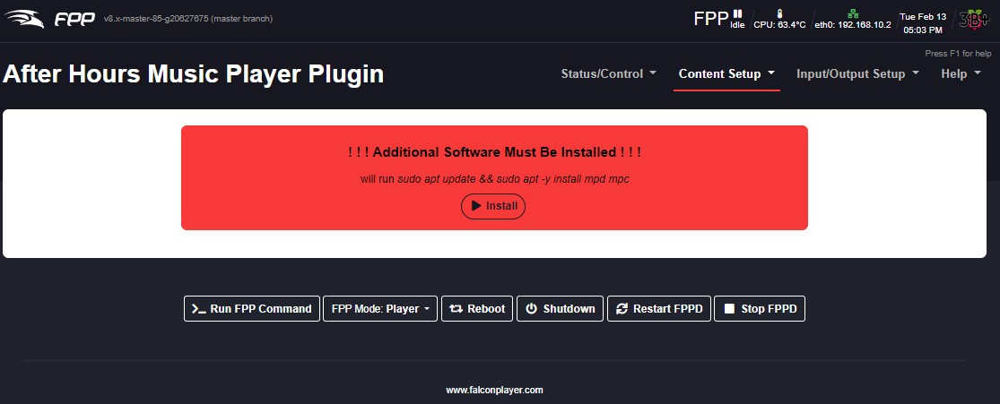
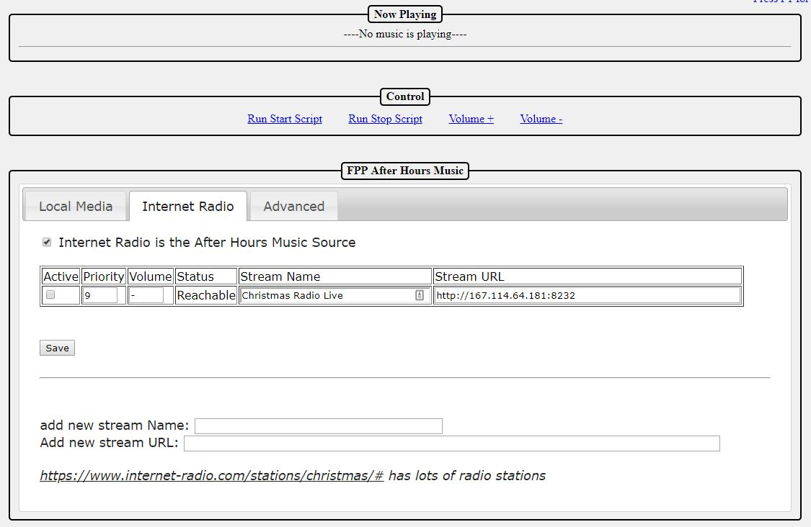

# FPP After Hours Music Manager

This plugin allows you to configure music sources for playback typically outside of show hours

### Known limitations / Gotchas
  - There is a known bug with fpp 2.5 that prevents scripts from running from playlists. You must switch to the master branch to use scripts (see https://falconchristmas.com/forum/index.php?topic=10032.0 for details)
  - When using a USB sound card you must add at least a 1 second pause entry in the playlist after the fpp-after-hours-stop.php script is called (failure to do this could cause your show to halt)
  
### Getting Started
1. Get sound working through fpp (ensure proper sound card is selected, go to Status/Control and then Status Page and click volume + and then volume - once (this ensures the volume is set to match fpp as there are sometimes inconsistencies)
2. Install the plugin
   - from the command line type: sudo git clone git://github.com/jcrossbdn/fpp-after-hours /home/fpp/media/plugins/fpp-after-hours
3. Navigate to the "Content Setup" menu in the Falcon Player User Interface and then the "After Hours Music" option. If you dont see this option then refresh your browser window.
4. You will then be presented with the After Hours plugin home page.
5. You will likely see only a screen that says "Additional Software Must Be Installed". Click the "Install now" button to install Media Player Daemon (mpd) and a control interface called mpc.  The after hours music plugin uses these applications to play music and are not optional. 

6. Once installation of mpd and mpc has completed you will be presented with a confirmation screen.  Click "Click here to return to after hours plugin page".

### Navigation

The plugin page is separated into a few sections (some sections will only be visible after music is configured:
- Now playing shows the current stream information including volume and title if provided by the radio station
- Control allows you to test the scripts (this runs the same scripts that are saved in the fpp scripts directory) and adjust the volume in real time (if music is currently running the original show volume will be displayed)
- Music Configuration
  - Local Media Tab - not available at this time
  - Internet Radio Tab - allows you to save internet radio station streams and make them available to be run, set priority and volume as well as see if the server responds to pings.
  - Advanced - Show different useful pieces of information or debugging information (work in progress)

### Adding a new Internet Radio Stream
1. At the bottom of the page there are two textboxes.  Enter the name or description you want in the Name field and add the URL of the stream in the URL field (see below for how to find the URL)
2. Click Save

### Testing an Internet Radio Stream
1. To test a stream you must make it Active by checking off the Active checkbox beside the desired stream
2. Then you can either set the priority to a lower number than all the other active streams or make all other streams Inactive by unchecking their Active checkboxes
3. Hit Save if you have made any changes above (this page does not auto-save)
4. Ensure that the status column shows "Reachable" for the stream.  If the fpp cannot communicate with a radio station it will show "Unreachable".
5. Click "Run Start Script" and the stream should start playing throught the system.
6. Use the "Volume +" or "Volume -" links to adjust the current volume to the desired level. Once you have the volume you want you can enter it into the volume textbox for that stream (without the % sign). Hit save once you have done this. If the volume is fine you can enter a hyphen "-" into the volume textbox.
7. Click "Run Stop Script" to stop the stream.  The volume will be automatically reverted to the "show volume" (the volume that the fpp was at before running the Start Script).

### Internet Radio Station selection order and priority
1. The Start Script will first look at all saved radio stations you have
2. It will then determine which ones are in an active state
3. It will then ping the server to see if it is online
4. It will then order the streams by priority (lowest to highest)
5. If multiple streams have the same priority then one will be randomly selected
6. The selected stream will be started
7. The current volume will be saved as "Show Volume" and the fpp volume will be adjusted if you have a value in the volume column for that station.

### How does volume work
When the Run Start Script button or fpp-after-hours-start.php script is executed the script will capture the current volume of the system and save it to a file.  
When the Run Stop Script button or fpp-after-hours-stop.php script is executed the script will reset the pi volume to the volume level previously captured.  
Volume + and - buttons will not be clickable if there is currently no stream playing (to prevent you from monkeying up your show volume level)

### Finding the URL of your favorite internet radio station
There are several internet radio streams available and you just have to find something that can be played by the "mpc" player.  I have found that some .m3u links don't work but most .pls streams seem to (I have not explored why).

https://www.internet-radio.com/stations/christmas/# is one site where you can find many stations.  Navigate to this website, find the station you would like and click on the ".pls" link.  Save the file or open with notepad or another text editor.

Here is a sample .pls file  
[playlist]  
NumberOfEntries=1  
File1=http://192.111.140.11:8576/listen.pls?sid=1

copy the http://192.111.140.11:8567 (ignore the ending slash and text) and that is your stream URL that you can paste into the after hours plugin page.

### Using this plugin in conjunction with your show playlist
1. Once the plugin is configured you will see two scripts presented in the fpp File Manager in the Scripts tab, one called fpp-after-hours-start.php and the other called fpp-after-hours-stop.php.

### Start and stop after hours using fpp playlist and schedule settings
1. To start and stop the after hours radio station go to the desired playlist (Content Setup / Playlists / click the desired playlist).
2. You can then add a new playlist entry, choose type: Script
3. Choose the Script named fpp-after-hours-start.php and click add
4. Choose the Script named fpp-after-hours-stop.php and click add
5. **It is highly recommended that you also add a type: Pause for 1 second (failure to do so could cause your show to not start properly especially if using a USB sound card)
6. Drag and drop the fpp-after-hours-stop.php script right under the grey "Lead In" row
7. Drag and drop the PAUSE-1 right under the fpp-after-hours-stop.php row **IMPORTANT
8. Drag and drop the fpp-after-hours-start.php script right under the grey "Lead Out" row
9. Click Save
10. The after hours radio station will now start when your show ends and stop when your show is about to start (show volume is saved when fpp-after-hours-start.php is run and restored when fpp-after-hours-stop.php is run)

### Why do I need a pause if using a USB sound card
With the USB sound card I have tested only one program can use the sound card at the same time. This pause ensures that the stop script has enough time to actually stop playing before fpp tries to start your playlist. If fpp tries to play music before after-hours has released fpp will error out and wait.

###Q & A
Q- I switched fpp to use a different sound card. Do I need to change anything in this plugin?
A- The plugin will automatically detect new sound cards and configure mpd to use the same one as fpp. It is recommended that you press the volume up and then volume down once on the fpp Status Page Screen to ensure the volume is set properly on the new card.

###Technical
- mpd and mpc are used by this plugin to play music
- a file is copied to cron.d to test for failed music. This cron will restart the playlist if problems are detected as long as the music is supposed to be operating
- mpd is configured with all known sound cards, the currently selected fpp sound card is forced on during mpd playback
- there is an uninstall script in the plugin directory that will unload cron, remove mpd & mpc, and remove plugin-data files used by this plugin. The main config file will not be deleted and is found in the plugindata directory.
