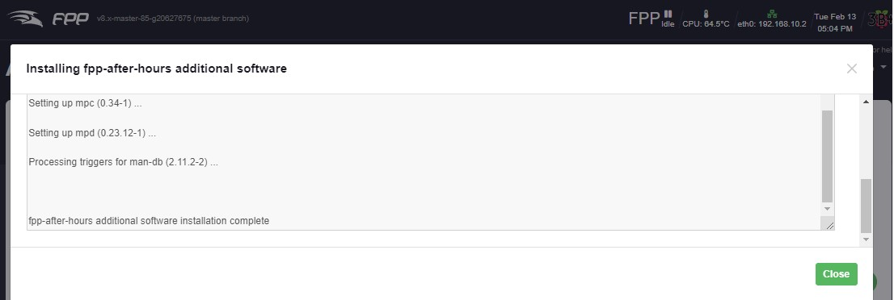
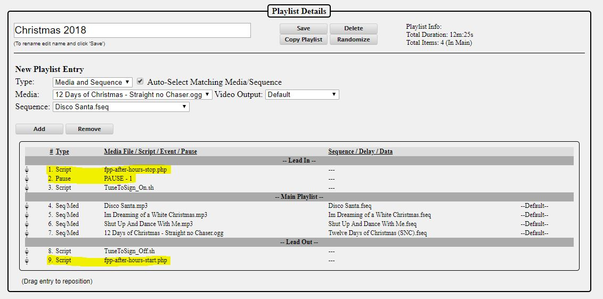

# FPP After Hours Music Manager

This plugin allows you to configure music sources for playback typically outside of show hours

### Known limitations / Gotchas
  - You must add at least a 1 second pause entry in the playlist after the fpp-after-hours-stop.php script is called (failure to do this could cause your show to halt especially if using a USB sound card).
  
### Getting Started
1. Get sound working through fpp (ensure proper sound card is selected, go to Status/Control and then Status Page and click volume + and then volume - once (this ensures the volume is set to match fpp as there are sometimes inconsistencies)
2. Install the plugin (you must be connected to the internet and have DNS properly configured to do this without errors)
   - from the fpp user interface, Content Setup / Plugin Manager, click on the install button beside the After Hours Music Player Plugin
3. Navigate to the "Content Setup" menu in the Falcon Player User Interface and then the "After Hours Music" option. If you dont see this option then refresh your browser window.
4. You will then be presented with the After Hours plugin home page.
5. You will likely see only a screen that says "Additional Software Must Be Installed". Click the "Install" button to install Media Player Daemon (mpd) and a control interface called mpc.  The after hours music plugin uses these applications to play music and are not optional. This installation can take a long time, don't leave your browser window until the page loading indicator has completed on your browser.  If you refresh or close your browser window before it completes you will have to install the dependencies manually from the command line.  The command is *sudo apt update && sudo apt -y install mpd mpc*

6. Once installation of mpd and mpc has completed you will be presented with a confirmation screen.  Click "Click here to return to after hours plugin page".

### After an OS Upgrade
You will have to reinstall all the dependencies, however, all your configurations should have been restored after the upgrade.  This installation can take a long time, don't leave your browser window until the page loading indicator has completed on your browser.  If you left the page early or clicked out of it you will have to install the dependencies manually from the command line.

Configuration files are located in /home/fpp/media/plugindata and will be backed up by fpp if you choose Backup Area "Plugin Settings" when doing an FPP Backup from the "Status/Control" menu.

### Navigation

This plugin is currently only setup to handle internet audio streams.  Local music is on the roadmap but has not been completed yet.

The page is separated into a few sections
- Now playing shows the current stream information including volume and title if provided by the radio station
- The control section allows you to run the play and stop scripts (this runs the same scripts that are saved in the fpp scripts directory) and adjust the volume in real time (if music is currently running the original show volume will be displayed)
- Stream Managment where you can create edit and delete streams.
  - On larger screens the stream name, url and volume are editable by clicking the text or you may click the edit icon
  - On smaller screens only the stream name will be visible but you may click the stream name to view and edit all options
  - The order in which streams should be attempted is controlled by dragging and dropping (from the order column) the item to whatever position you want it in.
  
### Adding a new Internet Radio Stream
1. Click the Add Stream button just below the controls section.  Enter the name or description you want in the Name field and add the URL of the stream in the URL field (see below for how to find the URL)
2. Click Create

### Testing an Internet Radio Stream
1. To test a stream you must make it Active by checking off the Active checkbox beside the desired stream
2. Then you can move the entry to the top of the list or make all other streams Inactive by unchecking their Active checkboxes
3. If there is an error reaching the url an alert icon will appear above the streams name.  This check does not ensure the url actually plays music, just that it is reachable.4. Click "Start" and the stream should start playing through the system.
5. Use the Volume slider to adjust the current volume to the desired level. Once you have the volume you want you can enter it into the volume setting for that stream and it will be used on future plays.
6. Click Stop to stop the stream.  The systems volume will be automatically reverted to the "show volume" (the volume that the fpp was at before running the Start Script).

### Internet Radio Station selection order and priority
1. The Start Script will first look at all saved radio stations you have
2. It will then determine which ones are in an active state
3. It will then ping the server to see if it is online
4. It will then look at the order you have them in on the user interface
5. The first available stream will be started
6. The current volume will be saved as "Show Volume" and the fpp volume will be adjusted if you have a value in the volume column for that station.

### How does volume work
- When the Start button is pressed or the fpp-after-hours-start.php script is executed the script will capture the current volume of the system and save it to a file.  
- When the Stop button is pressed or the fpp-after-hours-stop.php script is executed the script will reset the systems volume to the volume level previously captured.  

### Finding the URL of your favorite internet radio station
There are several internet radio streams available and you just have to find something that can be played by the "mpc" player.  I have found that some .m3u links don't work but most .pls streams seem to (I have not explored why).

https://www.internet-radio.com/stations/christmas/# is one site where you can find many stations.  Navigate to this website, find the station you would like and click on the ".pls" link.  Save the file or open with notepad or another text editor.

Here is a sample .pls file  
[playlist]  
NumberOfEntries=1  
File1=http://192.111.140.11:8576/listen.pls?sid=1

copy the http://192.111.140.11:8567 (ignore the ending slash and text) and that is your stream URL that you can paste into the after hours plugin page.

### Using this plugin in conjunction with your show playlist
Once the plugin is configured you will see there are two commands presented as "FPP Commands" in the playlist editor called "FPP After Hours Plugin - Start" and "FPP After Hours Plugin - Stop".

1. To start and stop the after hours radio station go to the desired playlist (Content Setup / Playlists / click the desired playlist).
2. You can then click "Add a Sequence/Entry"
    - Choose type: FPP Command
    - Choose Command: FPP After Hours Plugin - Start
      - If you want the plugin to fade in the music enter the number of seconds you want the fade to happen over (or 0 to not fade)
      - If you want to fade you can also set the starting volume of the fade as most audio you cant hear until 30-50 percent.
    - Click "Add"
3. Click "Add a Sequence/Entry" again
    - Choose type: FPP Command
    - Choose Command: FPP After Hours Plugin - Stop
      - If you want the plugin to fade out the music enter the number of seconds you want the fade to happen over (or 0 to not fade)
      - If you want to fade you can also set the ending volume of the fade as most audio you cant hear below 30-50 percent.
    - Click "Add"
4. **It is highly recommended that you also add a type: Pause for 1 second (failure to do so could cause your show to not start properly especially if using a USB sound card)
5. Drag and drop the "FPP After Hours Plugin - Stop" command into the "Lead In" section
6. Drag and drop the PAUSE right under the "FPP After Hours Plugin- Stop" command **IMPORTANT**
7. Drag and drop the "FPP After Hours Plugin - Start" command into the "Lead Out" section
8. Click Save Playlist
9. The after hours radio station will now start when your show ends and stop when your show is about to start

### Why do I need a pause if using a USB sound card
With the USB sound card I have tested only one program can use the sound card at the same time. This pause ensures that the stop script has enough time to actually stop playing before fpp tries to start your playlist. If fpp tries to play music before after-hours has released fpp will error out and wait. It is best practice with this plugin to add a 1 second pause all the time.

### Q & A
Q- I switched fpp to use a different sound card. Do I need to change anything in this plugin?

A- The plugin will automatically detect new sound cards and configure mpd to use the same one as fpp. It is recommended that you press the volume up and then volume down once on the fpp Status Page Screen to ensure the volume is set properly on the new card.  When a sound card is added or removed the plugin will take a few seconds to make necessary configuration changes and restart the mpd daemon when the start script is run (either through a playlist or by clicking Run Start Script. Subsequent start script runs should be instant.

### Technical
- mpd and mpc are used by this plugin to play music
- a file is copied to cron.d to test for failed music. This cron will restart the playlist if problems are detected as long as the music is supposed to be operating
- mpd is configured with all known sound cards, the currently selected fpp sound card is forced on during mpd playback
- there is an uninstall script in the plugin directory that will unload cron, remove mpd & mpc, and remove plugin-data files used by this plugin. The main config file will not be deleted and is found in the plugindata directory.

### API
All fpp-after-hours functions from the user interface are now handled by the fpp-after-hours API which is exposed on the computer running the fpp-after-hours plugin.  The API endpoints are as follows:

***

#### **Get stream and fpp-after-hours current details**

**GET** /api/plugin/fpp-after-hours/getDetails[?titleOnly]
- titleOnly (optional)
  - true = only return the title (returns HTTP 200: {status:true, data:"Stream Title"})
  - false = returns pertinant details to what fpp-after-hours is doing
- Returns 
  - When titleOnly is true: HTTP 200: {status:true, data:"Stream Title"}
  - When titleOnly is omitted or false:
    - HTTP 200: <pre>{
status: true, 
data:{
  &nbsp;&nbsp;title: string, (title of the currently running stream or "----No music is playing----" if there is no active stream)
  &nbsp;&nbsp;detail: string, (information from the player, can include volume and any errors)
  &nbsp;&nbsp;musicIsRunning: bool, (is music currently running in the MPD player)
  &nbsp;&nbsp;musicShouldBeRunning: bool, (is fpp-after-hours currently supposed to be playing music)
  &nbsp;&nbsp;dependenciesAreLoaded: bool, (is the MPD and MPC applications installed on this computer)
  &nbsp;&nbsp;mpdVolume: string (what is the current volume returned by the MPD player)
  &nbsp;&nbsp;}
}</pre>

***

#### **Get Streams**
**GET** /api/plugin/fpp-after-hours/getStreams[?noPing]
- noPing *(optional)*
  - true = do not attempt to ping stream endpoints during scan (faster response)
  - false *default = ping stream endpoints during scan
- Returns:
  - Streams Present (HTTP 200): <pre>{
status: true, 
count: int, (number of streams in data array)
data:{
  &nbsp;&nbsp;x: {  (keyed on priority 1-999999)
      &nbsp;&nbsp;&nbsp;&nbsp;active: bool, (true or false)
      &nbsp;&nbsp;&nbsp;&nbsp;url: string, (full url of the stream as a string)
      &nbsp;&nbsp;&nbsp;&nbsp;volume: int, (volume percentage as integer between 0 and 100)
      &nbsp;&nbsp;&nbsp;&nbsp;priority: int, (the order as an integer in which this stream should be displayed and used)
      &nbsp;&nbsp;&nbsp;&nbsp;uid: int, (the unique id as an integer of the stream)
      &nbsp;&nbsp;&nbsp;&nbsp;streamName: string (a descriptive name of the stream as a string)
      &nbsp;&nbsp;&nbsp;&nbsp;}
  &nbsp;&nbsp;}
}</pre>
  - No Streams Present (HTTP 200): {status:true, count:0, data:[]}

***

#### **Get Stream Availability**
Tests the url for successful connection.  Does not actually make sure the endpoint is a valid stream

**GET** /api/plugin/fpp-after-hours/getStreamPing?uid
- uid (required)
  - uid is found in the fpp-after-hours-config.json file or the getStreams API endpoint
- Returns:
  - Stream endpoint was reached (HTTP 200): {status:true}
  - Stream endpoint was tested but could not be reached (HTTP 200): {status:false}
  - Error (HTTP 200): {status:false, data:"The error message"}

***

#### **Start the first available stream**

**GET** /api/plugin/fpp-after-hours/start
- Returns HTTP 200: {status:true}

***

#### **Stop the currently playing stream**

**GET** /api/plugin/fpp-after-hours/stop
- Returns HTTP 200: {status:true}

***

#### **Set MPD Volume**
Will only change the volume of the MPD player and only works when MPD is playing (fpp-after-hours is in control of the audio)

**GET** /api/plugin/fpp-after-hours/setMPDvolume?value
- value (required)
  - can be a volume percentage between 0 and 100 as integer
  - can specify an increase of x percent by prepending an "a"  (e.g. to increase 10% send ?value=a10)
  - can specify a decrease of x percent by prepending an "s" (e.g. to decrease 10% send ?value=s10)
- Returns HTTP 200: {status:true, data:"the new volume returned by MPD"}

***

#### **Update Stream**
**POST** /api/plugin/fpp-after-hours/updateStream
- priority[*order (zero indexed)*][*uid*]
  - should be posted as such [{0:first uid},{1:second uid},{2:third uid}]
  - priority must contain all streams with their order in the tree.  There is no error checking for mismatches or duplicates
  - is not required to be provided for an update of other values or for a new entry
- uid *(required except for calls only for priority updates)*
  - to create a new stream entry pass a 0 to uid
- name *(required except for calls only for priority updates)*
  - a string value describing the stream
- url *(required except for calls only for priority updates)*
  - a valid url to an internet stream endpoint
- active *(optional)*
  - true *default
  - false
- volume *(optional)*
  - an integer between 0 and 100
    - *100 is default
- Returns:
  - Successful (HTTP 200): {status:true}
  - Error (HTTP 200): {status:false}

***

#### **Delete Stream**
**GET** /api/plugin/fpp-after-hours/deleteStream?deleteStream=*&lt;uid of stream&gt;*
- deleteStream is required
  - uid is found in the fpp-after-hours-config.json file or the getStreams API endpoint
- Returns:
  - Successful (HTTP 200): {status:true}
  - Error (HTTP 200): {status:false, data:"The error message"}

***

#### **Update Scripts**
Will check all scripts and crontab entries and update them if there are any changes

**GET** /api/plugin/fpp-after-hours/updateScripts
- Returns
  - Successful HTTP 200: {status:true}
  - Any Error HTTP 200: {status:false, data:{"error 1","error2","error3"}}

***

#### **Install Dependencies**
Will run the linux command "sudo apt update && sudo apt -y install mpd mpc"

**GET** /api/plugin/fpp-after-hours/installDependencies[?stream]
- stream (optional)
  - true *default (will run the command in such a way that its output can be streamed to the user interface live)
  - false (will run the command and return once completed)
- Returns HTTP 200: {status:true}
